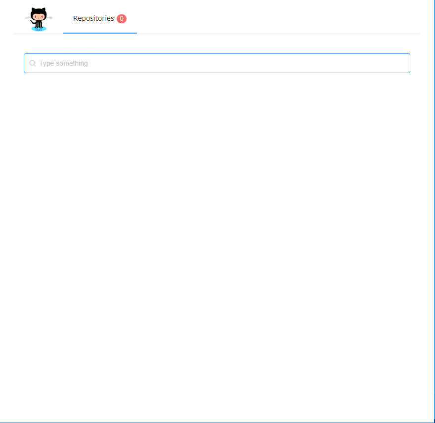

Github Viewer
=============

Demo
----

https://github-viewer.netlify.com/repositories/



For developer
-------------

### Install dependencies

```
$ npm install
```

### Debug

```
$ npm run dev
```

### Build and Start

```
$ npm run build
$ npm start
```
